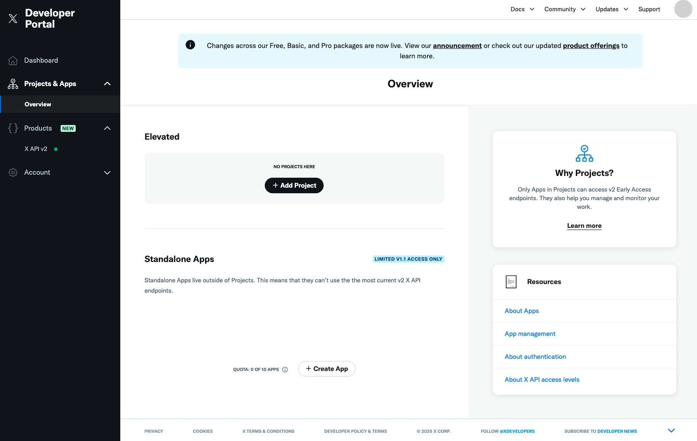

<!-- SERVICE:DETAILS -->

:::note
Apprise uses the X API v2 exclusively. X API subscription requirements and tier names have changed frequently since 2023 -- consult the [X Developer Portal](https://developer.x.com/en/products/x-api) for current access levels and pricing. As a general guide:

- **Tweets** (`mode=tweet`) -- require write access to the X API v2.
- **Direct Messages** (`mode=dm`, the default) -- require a higher level of access that includes Direct Message write permissions.

Media uploads (attachments) use the X API v2 media endpoint, which is available across all access levels.
:::

## Account Setup

You need to register for an X developer account at [developer.x.com](https://developer.x.com/en).

:::caution
Your credentials **must** come from an X App that is attached to a **Project**, not a Standalone App. If you log into the [X Developer Portal](https://developer.x.com/en/portal/projects-and-apps) and see your app listed directly under a tier label (e.g. "Free") with no Project grouping it, it is a Standalone App and its tokens will be rejected by the X API v2 with a `Client Forbidden` / `client-not-enrolled` error.

To fix this, create a new Project via the Developer Portal, add an App inside it, configure the User authentication settings, and generate a fresh set of all four tokens from that App. Standalone Apps cannot be moved into a Project -- new credentials are required.
:::

X Direct Messages are slightly more complicated than some of the other notification services, so here is a quick breakdown of what you need to know and do in order to send notifications through it using this tool:

### If there are Project and App

When you registered to X developer account, you may have already created a default project and app. You can use this app -- it's through an X App we will be able to send our DMs.

1. First off, you'll need to **regenerate the API Keys**. This is done by accessing the app name under **Projects & Apps** (on left menu), then under the **Consumer Keys** from the "_Keys and tokens_" Tab. Once generated, copy it to a safe place. This is **Consumer Keys**.<br/>
2. Next, grant the appropriate access permissions so that you can post or send DMs. After clicking on the app name under **Projects & Apps** (on left menu), click on **Set up** under the **User authentication settings** section.<br/><br/>On the **User authentication settings** page, set the following
   - **App permissions**\
     Select **Read and write** if you want to post only. If you want to send DMs, select **Read and write and Direct message**.
   - **Type of App**\
     Select **Web App, Automated App or Bot**
   - **App info**\
     Enter any URL for **Callback URI / Redirect URL** and **Website URL**. If you are using Apprise to send posts or DMs, it doesn't matter what you enter.

   Once you entered them all, click **Save**.

3. Lastly, you'll need to **regenerate the Access Tokens**. This is done under the **Authentication Tokens** from the "_Keys and tokens_" Tab. Once generated, copy it to a safe place.<br/>

### If there is no Project and App

1. First off, you need to create a project and an X App (not Standalone apps) from [developer.x.com](https://developer.x.com/en/portal/projects-and-apps). It's through an X App we will be able to send our DMs.<br/><br/>X asks you to justify why you need it as long as you specify the purpose of your app in detail.
2. Once you created the app, you'll see the **API Tokens** on the screen, so copy it to a safe place. This is **Consumer Keys**.<br/>
3. Next, grant the appropriate access permissions so that you can post or send DMs. After clicking on the app name under **Projects & Apps** (on left menu), click on **Set up** under the **User authentication settings** section.<br/><br/>On the **User authentication settings** page, set the following
   - **App permissions**\
     Select **Read and write** if you want to post only. If you want to send DMs, select **Read and write and Direct message**.
   - **Type of App**\
     Select **Web App, Automated App or Bot**
   - **App info**\
     Enter any URL for **Callback URI / Redirect URL** and **Website URL**. If you are using Apprise to send posts or DMs, it doesn't matter what you enter.

   Once you entered them all, click **Save**.

4. Lastly, you'll need to **generate the Access Tokens**. This is done under the **Authentication Tokens** from the "_Keys and tokens_" Tab. Once generated, copy it to a safe place.<br/>

You should now have the following 4 tokens ready to use.

- A Consumer Key (An API Key)
- A Consumer Secret (An API Secret)
- An Access Token
- An Access Token Secret

From here you're ready to go. You can post public tweets or send Direct Messages through the use of the `mode=` variable. By default, Direct Messaging (DM) is used.

:::caution
Direct Messaging requires a higher level of X API access than tweet posting. If your account does not have Direct Message write permissions, use `mode=tweet` instead and check the [X Developer Portal](https://developer.x.com/en/products/x-api) for the subscription that includes DM access.
:::

## Syntax

Valid syntax is as follows (`x://`, `twitter://`, and `tweet://` are all accepted aliases):

- `x://{ConsumerKey}/{ConsumerSecret}/{AccessToken}/{AccessSecret}`
- `x://{ScreenName}@{ConsumerKey}/{ConsumerSecret}/{AccessToken}/{AccessSecret}`

If you know the targets you wish to identify, they can be targeted by their X Screen Name:

- `x://{ConsumerKey}/{ConsumerSecret}/{AccessToken}/{AccessSecret}/{ScreenName}`
- `x://{ConsumerKey}/{ConsumerSecret}/{AccessToken}/{AccessSecret}/{ScreenName1}/{ScreenName2}/{ScreenNameN}`

:::note
If no ScreenName is specified, then by default the Direct Message is sent to your own account.
:::

A public tweet can be referenced like so (requires X API v2 write access):

- `x://{ConsumerKey}/{ConsumerSecret}/{AccessToken}/{AccessSecret}?mode=tweet`

## Parameter Breakdown

| Variable       | Required | Description                                                                                                                                                       |
| -------------- | -------- | ----------------------------------------------------------------------------------------------------------------------------------------------------------------- |
| ScreenName     | Yes      | The UserID of your account such as _l2gnux_ (if your id is @l2gnux). You must specify a `{userid}` _or_ an `{ownerid}`.                                           |
| ConsumerKey    | Yes      | The Consumer Key (API Key)                                                                                                                                        |
| ConsumerSecret | Yes      | The Consumer Secret Key (API Secret Key)                                                                                                                          |
| AccessToken    | Yes      | The Access Token; you would have had to generate this one from your X App Configuration.                                                                          |
| AccessSecret   | Yes      | The Access Secret; you would have had to generate this one from your X App Configuration.                                                                         |
| Mode           | No       | The X mode you want to operate in. Use `tweet` to post publicly or `dm` to send a Direct Message (requires DM write permissions). By default this is set to `dm`. |
| batch          | No       | By default images are batched together. However if you want your attachments to be posted 1 post per attachment, set this to False.                               |

<!-- TEMPLATE:SERVICE-PARAMS -->

## Examples

Send a public tweet (requires X API v2 write access):

```bash
# Assuming our {ConsumerKey} is T1JJ3T3L2
# Assuming our {ConsumerSecret} is A1BRTD4JD
# Assuming our {AccessToken} is TIiajkdnlazkcOXrIdevi7F
# Assuming our {AccessSecret} is FDVJaj4jcl8chG3
apprise -vv -t "Test Message Title" -b "Test Message Body" \
   x://T1JJ3T3L2/A1BRTD4JD/TIiajkdnlazkcOXrIdevi7F/FDVJaj4jcl8chG3?mode=tweet
```

Or using the `tweet://` schema alias (implies `mode=tweet`):

```bash
apprise -vv -t "Test Message Title" -b "Test Message Body" \
   tweet://T1JJ3T3L2/A1BRTD4JD/TIiajkdnlazkcOXrIdevi7F/FDVJaj4jcl8chG3
```

Send a X DM to @testaccount (requires X API DM write permissions):

```bash
# Assuming our {ConsumerKey} is T1JJ3T3L2
# Assuming our {ConsumerSecret} is A1BRTD4JD
# Assuming our {AccessToken} is TIiajkdnlazkcOXrIdevi7F
# Assuming our {AccessSecret} is FDVJaj4jcl8chG3
# our user is @testaccount
apprise -vv -t "Test Message Title" -b "Test Message Body" \
   x://testaccount@T1JJ3T3L2/A1BRTD4JD/TIiajkdnlazkcOXrIdevi7F/FDVJaj4jcl8chG3
```

Or

```bash
apprise -vv -t "Test Message Title" -b "Test Message Body" \
   twitter://testaccount@T1JJ3T3L2/A1BRTD4JD/TIiajkdnlazkcOXrIdevi7F/FDVJaj4jcl8chG3
```
