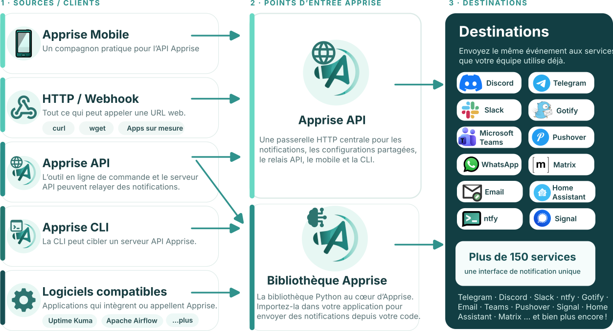

<style>{`
  :root[data-theme="dark"] .apprise-flow img {
    content: url("./images/apprise-overview-dark.svg");
  }

  :root[data-theme="light"] .apprise-flow img {
    content: url("./images/apprise-overview-light.svg");
  }
`}</style>

La bibliothèque Apprise vous permet d'envoyer des notifications vers la quasi-totalité des services de notification populaires d'aujourd'hui (Telegram, Discord, Slack, email, etc.) à l'aide d'une API Python unique et unifiée.

La bibliothèque est le moteur sous tout le reste : la CLI, le serveur API et l’application mobile passent tous par elle.

<picture class="apprise-flow apprise-flow--library">
  <source
    srcset="./images/apprise-overview-dark.svg"
    media="(prefers-color-scheme: dark)"
  />
  
</picture>

Pour les utilitaires communs utilisés dans les plugins, consultez la [référence des utilitaires](./utilities/).

## Installation

Apprise est disponible sur PyPI et peut être installé via `pip`.

```bash
pip install apprise
```

Si votre projet utilise [uv](https://docs.astral.sh/uv/) :

```bash
uv add apprise
```

## Structure de la bibliothèque

La bibliothèque Python Apprise s'articule autour de quelques objets principaux :

- `Apprise` pour enregistrer des services et envoyer des notifications
- `AppriseConfig` pour charger une configuration depuis des fichiers ou des sources distantes
- `AppriseAsset` pour définir le contexte global d'exécution
- Les classes de plugins (`NotifyBase`) pour implémenter des services individuels

## Pour commencer

Si vous débutez avec l'intégration Python d'Apprise :

1. Commencez par le [démarrage rapide](./quick-start/)
1. Explorez ensuite la [configuration](./configuration/)
1. Consultez [les ressources et l'image de marque](./assets/) pour comprendre le contexte global d'exécution
1. Lisez [l'inspection et le débogage](./inspection/) si vous construisez des outils ou avez besoin de diagnostics

## Référence avancée

Les pages de cette section couvrent aussi :

- Les [pièces jointes](./attachments/)
- Le [stockage persistant](./persistent-storage/)
- Le [développement de plugins](./plugin/)
- Les [points d'extension](./extending/)
- Les [variables de substitution](../getting-started/template/)
  pour fournir des valeurs YAML au moment de l'envoi
