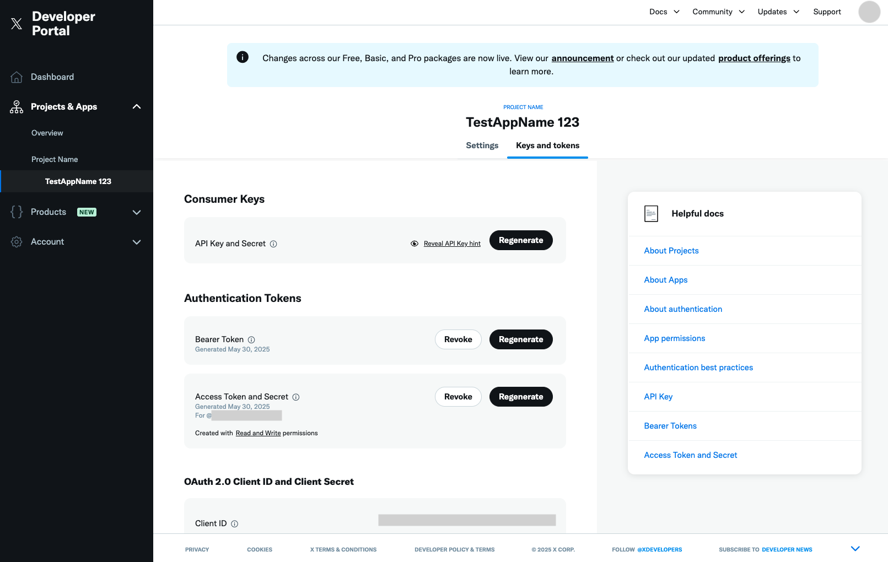
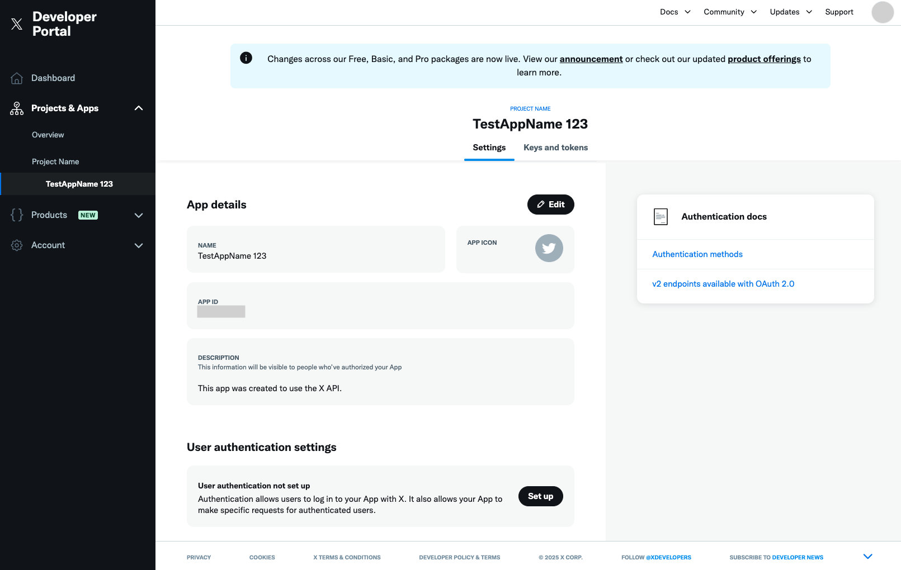
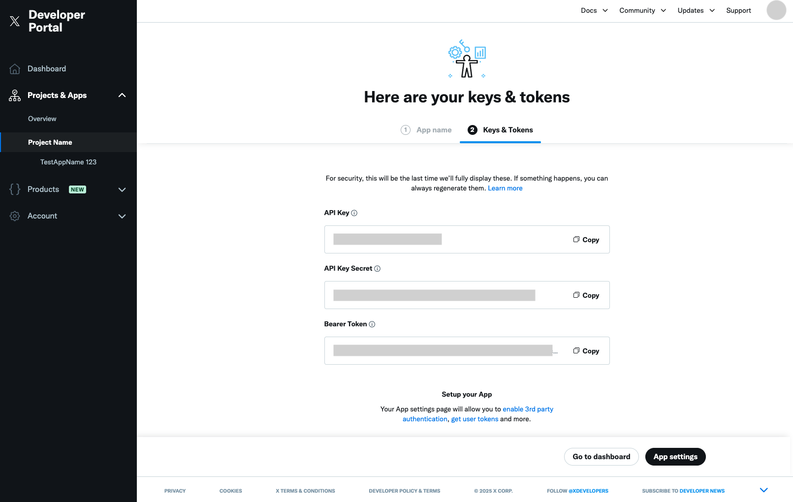

<!-- SPONSORS:BANNER -->
<!-- SERVICE:DETAILS -->

:::note
Apprise utilise exclusivement l'API X v2. Les abonnements et niveaux d'acces de l'API X ont frequemment change depuis 2023 -- consultez le [Portail Developpeur X](https://developer.x.com/en/products/x-api) pour connaitre les niveaux d'acces et les tarifs actuels. A titre indicatif :

- **Tweets** (`mode=tweet`) -- necessitent un acces en ecriture a l'API X v2.
- **Messages directs** (`mode=dm`, mode par defaut) -- necessitent un niveau d'acces superieur incluant les permissions d'ecriture de messages directs.

Les envois de medias (pieces jointes) utilisent l'endpoint media de l'API X v2, disponible sur tous les niveaux d'acces.
:::

## Configuration du compte

Vous devez creer un compte developpeur X sur [developer.x.com](https://developer.x.com/en).

:::caution
Vos identifiants doivent provenir d'une application X rattachee a un **Projet**, et non d'une application autonome (Standalone App). Si, apres vous etre connecte au [Portail Developpeur X](https://developer.x.com/en/portal/projects-and-apps), votre application apparait directement sous un libelle de niveau (par exemple "Free") sans etre regroupee dans un Projet, il s'agit d'une application autonome dont les jetons seront rejetes par l'API X v2 avec une erreur `Client Forbidden` / `client-not-enrolled`.

Pour corriger cela, creez un nouveau Projet via le Portail Developpeur, ajoutez-y une application, configurez les parametres d'authentification utilisateur, puis generez un nouvel ensemble complet de quatre jetons depuis cette application. Les applications autonomes ne peuvent pas etre migrees vers un Projet -- de nouveaux identifiants sont necessaires.
:::

Les messages directs X sont un peu plus complexes a configurer que certains autres services de notification. Voici donc un resume rapide de ce qu'il faut savoir et faire pour envoyer des notifications avec cet outil.

### Si un Projet et une App Existent Deja

Lors de la creation de votre compte developpeur X, un projet et une application par defaut ont peut-etre deja ete crees. Vous pouvez utiliser cette application ; c'est elle qui permettra l'envoi de vos messages directs.

1. Commencez par **regenerer les cles API**. Pour cela, ouvrez le nom de l'application dans **Projects & Apps** dans le menu de gauche, puis allez dans **Consumer Keys** depuis l'onglet "_Keys and tokens_". Une fois generees, copiez-les dans un endroit sur. Il s'agit des **Consumer Keys**.<br/>
2. Accordez ensuite les autorisations necessaires pour publier des posts ou envoyer des messages directs. Apres avoir clique sur le nom de l'application dans **Projects & Apps**, cliquez sur **Set up** dans la section **User authentication settings**.<br/><br/>Dans la page **User authentication settings**, configurez :
   - **App permissions**\
     Selectionnez **Read and write** si vous souhaitez seulement publier. Si vous voulez envoyer des messages directs, choisissez **Read and write and Direct message**.
   - **Type of App**\
     Selectionnez **Web App, Automated App or Bot**
   - **App info**\
     Saisissez n'importe quelle URL dans **Callback URI / Redirect URL** et **Website URL**. Si vous utilisez Apprise pour publier ou envoyer des messages directs, la valeur exacte n'a pas d'importance.

   Une fois tout saisi, cliquez sur **Save**.

3. Enfin, vous devrez **regenerer les jetons d'acces**. Cela se fait dans **Authentication Tokens** depuis l'onglet "_Keys and tokens_". Une fois generes, copiez-les dans un endroit sur.<br/>

### Si Aucun Projet ni Aucune App n'Existent

1. Vous devez d'abord creer un projet et une application X, et non une Standalone app, depuis [developer.x.com](https://developer.x.com/en/portal/projects-and-apps). C'est via cette application X que vous pourrez envoyer vos messages directs.<br/><br/>X vous demandera de justifier votre besoin si vous decrivez le but de votre application.
2. Une fois l'application creee, vous verrez les **jetons API** a l'ecran ; copiez-les dans un endroit sur. Il s'agit des **Consumer Keys**.<br/>
3. Accordez ensuite les autorisations necessaires pour publier des posts ou envoyer des messages directs. Apres avoir clique sur le nom de l'application dans **Projects & Apps**, cliquez sur **Set up** dans la section **User authentication settings**.<br/><br/>Dans la page **User authentication settings**, configurez :
   - **App permissions**\
     Selectionnez **Read and write** si vous souhaitez seulement publier. Si vous voulez envoyer des messages directs, choisissez **Read and write and Direct message**.
   - **Type of App**\
     Selectionnez **Web App, Automated App or Bot**
   - **App info**\
     Saisissez n'importe quelle URL dans **Callback URI / Redirect URL** et **Website URL**. Si vous utilisez Apprise pour publier ou envoyer des messages directs, la valeur exacte n'a pas d'importance.

   Une fois tout saisi, cliquez sur **Save**.

4. Enfin, vous devrez **generer les jetons d'acces**. Cela se fait dans **Authentication Tokens** depuis l'onglet "_Keys and tokens_". Une fois generes, copiez-les dans un endroit sur.<br/>

Vous devriez maintenant disposer des 4 jetons suivants prets a l'emploi :

- une Consumer Key, c'est-a-dire une cle API ;
- un Consumer Secret, c'est-a-dire un API Secret ;
- un jeton d'acces ;
- un secret de jeton d'acces.

A partir de la, vous etes pret. Vous pouvez publier des tweets publics ou creer des messages directs grace a la variable `mode=`. Par defaut, le mode Message Direct (`dm`) est utilise.

:::caution
L'envoi de messages directs necessite un niveau d'acces X API superieur a celui requis pour les tweets. Si votre compte ne dispose pas des permissions d'ecriture de messages directs, utilisez plutot `mode=tweet` et consultez le [Portail Developpeur X](https://developer.x.com/en/products/x-api) pour l'abonnement incluant l'acces aux messages directs.
:::

## Syntaxe

La syntaxe valide est la suivante (`x://`, `twitter://` et `tweet://` sont tous des alias acceptes) :

- `x://{ConsumerKey}/{ConsumerSecret}/{AccessToken}/{AccessSecret}`
- `x://{ScreenName}@{ConsumerKey}/{ConsumerSecret}/{AccessToken}/{AccessSecret}`

Si vous connaissez les cibles a identifier, vous pouvez les viser par leur nom d'utilisateur X, leur `ScreenName` :

- `x://{ConsumerKey}/{ConsumerSecret}/{AccessToken}/{AccessSecret}/{ScreenName}`
- `x://{ConsumerKey}/{ConsumerSecret}/{AccessToken}/{AccessSecret}/{ScreenName1}/{ScreenName2}/{ScreenNameN}`

:::note
Si aucun `ScreenName` n'est precise, le message direct est envoye par defaut a votre propre compte.
:::

Un tweet public peut etre reference ainsi (necessite un acces en ecriture a l'API X v2) :

- `x://{ConsumerKey}/{ConsumerSecret}/{AccessToken}/{AccessSecret}?mode=tweet`

## Detail des Parametres

| Variable       | Obligatoire | Description                                                                                                                                                                   |
| -------------- | ----------- | ----------------------------------------------------------------------------------------------------------------------------------------------------------------------------- |
| ScreenName     | Oui         | Identifiant de votre compte, par exemple _l2gnux_ si votre identifiant est `@l2gnux`. Vous devez preciser un `{userid}` ou un `{ownerid}`.                                    |
| ConsumerKey    | Oui         | Consumer Key, c'est-a-dire la cle API.                                                                                                                                        |
| ConsumerSecret | Oui         | Consumer Secret Key, c'est-a-dire l'API Secret Key.                                                                                                                           |
| AccessToken    | Oui         | Jeton d'acces genere depuis la configuration de votre application X.                                                                                                          |
| AccessSecret   | Oui         | Secret d'acces genere depuis la configuration de votre application X.                                                                                                         |
| Mode           | Non         | Mode X a utiliser. Utilisez `tweet` pour publier un message public ou `dm` pour envoyer un message direct (permissions d'ecriture DM requises). Par defaut, `dm` est utilise. |
| batch          | Non         | Par defaut, les images sont regroupees ensemble. Si vous voulez publier une publication par piece jointe, definissez cette valeur sur `False`.                                |

<!-- TEMPLATE:SERVICE-PARAMS -->

## Exemples

Envoyer un tweet public (necessite un acces en ecriture a l'API X v2) :

```bash
# Supposons que notre {ConsumerKey} soit T1JJ3T3L2
# Supposons que notre {ConsumerSecret} soit A1BRTD4JD
# Supposons que notre {AccessToken} soit TIiajkdnlazkcOXrIdevi7F
# Supposons que notre {AccessSecret} soit FDVJaj4jcl8chG3
apprise -vv -t "Titre du Message de Test" -b "Corps du Message de Test" \
   x://T1JJ3T3L2/A1BRTD4JD/TIiajkdnlazkcOXrIdevi7F/FDVJaj4jcl8chG3?mode=tweet
```

Ou en utilisant l'alias de schema `tweet://` (implique `mode=tweet`) :

```bash
apprise -vv -t "Titre du Message de Test" -b "Corps du Message de Test" \
   tweet://T1JJ3T3L2/A1BRTD4JD/TIiajkdnlazkcOXrIdevi7F/FDVJaj4jcl8chG3
```

Envoyer un message direct X a `@testaccount` (necessite les permissions d'ecriture DM de l'API X) :

```bash
# Supposons que notre {ConsumerKey} soit T1JJ3T3L2
# Supposons que notre {ConsumerSecret} soit A1BRTD4JD
# Supposons que notre {AccessToken} soit TIiajkdnlazkcOXrIdevi7F
# Supposons que notre {AccessSecret} soit FDVJaj4jcl8chG3
# notre utilisateur est @testaccount
apprise -vv -t "Titre du Message de Test" -b "Corps du Message de Test" \
   x://testaccount@T1JJ3T3L2/A1BRTD4JD/TIiajkdnlazkcOXrIdevi7F/FDVJaj4jcl8chG3
```

Ou

```bash
apprise -vv -t "Titre du Message de Test" -b "Corps du Message de Test" \
   twitter://testaccount@T1JJ3T3L2/A1BRTD4JD/TIiajkdnlazkcOXrIdevi7F/FDVJaj4jcl8chG3
```
